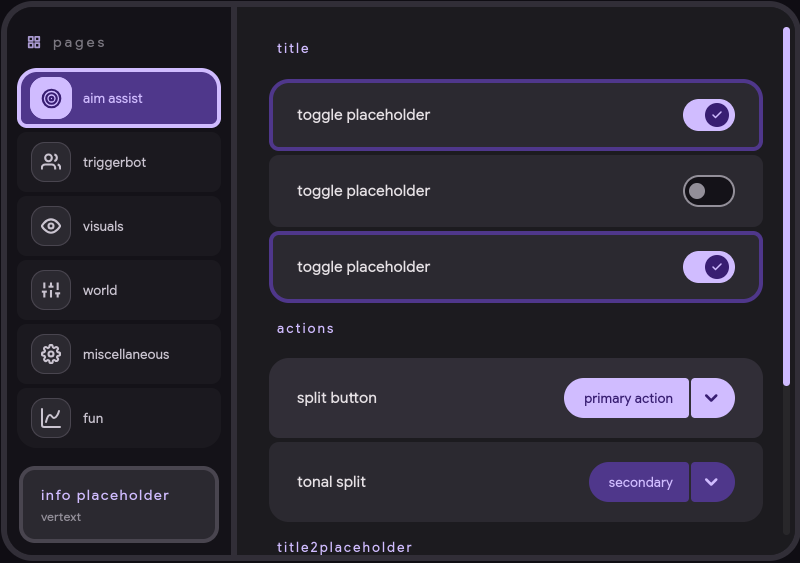

# virex-game-hud

an expressive material 3 game overlay ui framework. tailwind css, vanilla html, vanilla js. 
built for injected overlays and standalone game ui. standard two-panel layout, dynamic theming, and decent fluid animations.

---

---
## planned features

- [ x ] material 3 expressive design language (m3 dark)
- [ x ] two-panel layout: nav sidebar + scrollable content
- [ / ] hugging corner style sidebar (sharp inner, rounded outer)
- [ x ] expressive component rounding (first/last child logic)
- [ x ] optical centering & fluid morphing animations
- [ / ] dynamic accent color theming via css custom properties
- [ x ] zero-dependency logic (no frameworks, just raw speed)

---

## usage

everything is self-contained. link the styles and scripts in your entry point.

```html
<link rel="stylesheet" href="hud.css">
<script src="tabs.js"></script>
<script src="hud.js"></script>
```

populate your nav tabs in `tabs.js` and render your content via the panel map in `hud.js`.

---

## controls

| component | status | description |
|-----------|--------|-------------|
| `Switch` | x | material 3 toggle with checkmark icon. |
| `Slider` | x | range input with fluid animation and value tooltip. |
| `Split Button` | x | dual-action button with morphing dropdown menu. |
| `Text` | x | simple labeled information display. |
| `Keybind` | ? | *planned* - records a key press. |
| `NumberInput` | ? | *planned* - numeric input with increment buttons. |

---

## theming

all colors are css custom properties on `:root`. change them at runtime to swap accent colors or themes.

```css
--vx-accent: #D0BCFF; /* main branding color */
--vx-surface: #1C1B1F; /* panel background */
```

---

## structure

```
virex-game-hud/
├── index.html   # layout root
├── hud.css      # core styles & m3 tokens
├── hud.js       # component logic & panel rendering
└── tabs.js      # sidebar navigation registry
```

---

## license

mit. do whatever, credit appreciated.
